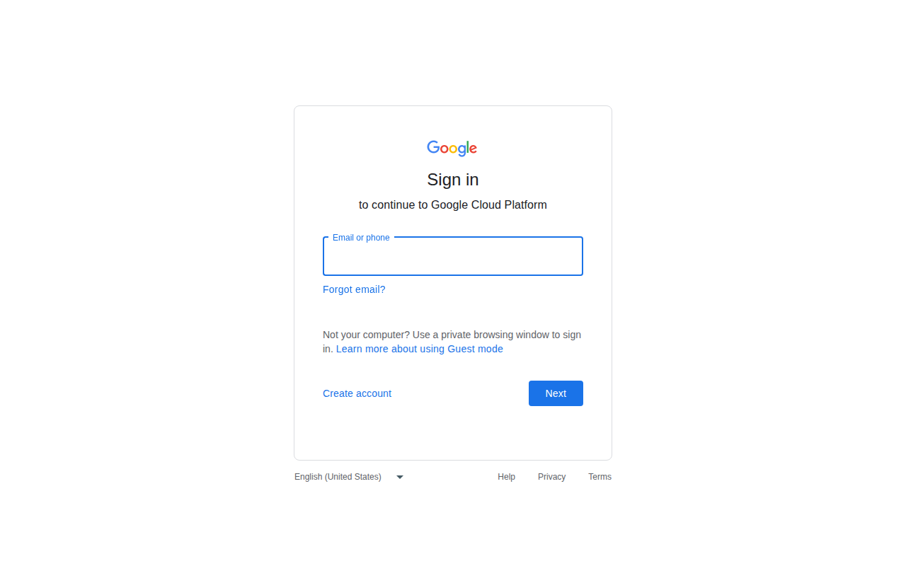

# Google Workspace Integration



## 1. Google Cloud Project
- Go to https://console.cloud.google.com/
- Create project: `Hermes-Agent-Workspace`
- **Enabled APIs:**
  - Gmail API
  - Google Drive API
  - Google Docs API
  - Google Sheets API
  - Google Slides API

## 2. OAuth Setup
- APIs & Services → OAuth consent screen → External/Testing
- Scopes: `email`, `profile`, `gmail.readonly`, `drive`, `docs`, `sheets`, `slides`
- Create OAuth 2.0 Client ID → Desktop app
- Download `client_secret.json` → `~/.hermes/google_client_secret.json`

## 3. Hermes Integration
```bash
# Use google-workspace or google-drive-download skills
hermes -s google-workspace
```
