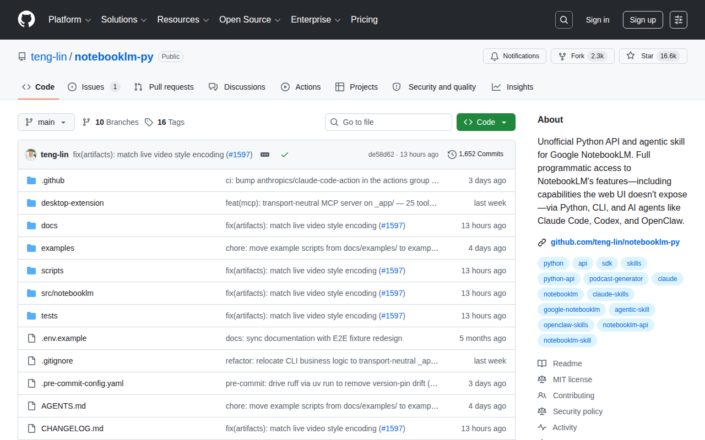
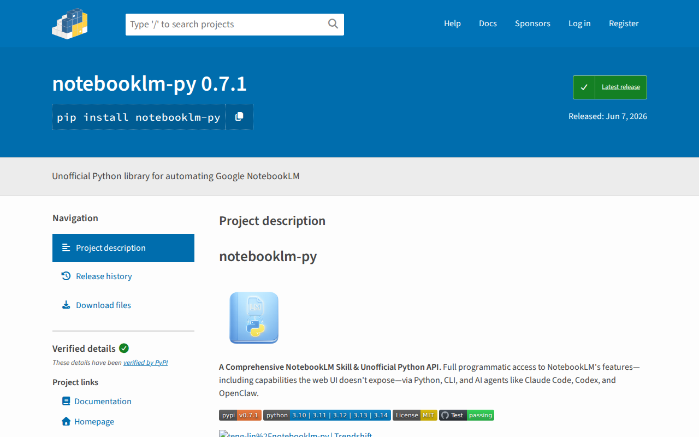

# NotebookLM Automation


**Repo:** https://github.com/teng-lin/notebooklm-py



Programmatic access to Google NotebookLM — upload PDFs, chat with sources, generate audio/video/quizzes, export artifacts. Works as CLI, Python API, MCP server, or AI agent skill.

## Install

Preferred — isolated install with `uv tool` (no dep clashes):

```bash
curl -LsSf https://astral.sh/uv/install.sh | sh
uv tool install "notebooklm-py[browser]"
```

Or inside a venv:

```bash
python3 -m venv .venv && source .venv/bin/activate
pip install "notebooklm-py[browser]"
```



## Auth

```bash
notebooklm login
# Opens browser → sign in with your Google account
# Chromium auto-downloads on first run (~170MB)
```

Verify:

```bash
notebooklm auth check --test --json
# → {"status": "ok"}
```

## CLI Quickstart

```bash
# 1. Create notebook
notebooklm create "SLR Corpus"
notebooklm use <notebook_id>

# 2. Add PDFs / URLs / YouTube
notebooklm source add "./paper.pdf"
notebooklm source add "https://arxiv.org/abs/2301.00234"

# 3. Chat with sources
notebooklm ask "Summarize the key methods across all papers"

# 4. Generate artifacts
notebooklm generate audio "deep dive" --wait
notebooklm generate quiz --difficulty hard --wait
notebooklm generate slide-deck --wait

# 5. Download
notebooklm download audio ./podcast.mp3
notebooklm download quiz --format markdown ./quiz.md
notebooklm download slide-deck ./slides.pdf
```

## Python API

```python
import asyncio
from notebooklm import NotebookLMClient

async def main():
    async with NotebookLMClient.from_storage() as client:
        # Create notebook
        nb = await client.notebooks.create("My SLR")

        # Add PDF source
        await client.sources.add_file(
            nb.id, "./paper.pdf",
            title="Paper Title",
            wait=True
        )

        # Query
        result = await client.chat.ask(
            nb.id,
            "What are the key findings?"
        )
        print(result.answer)

asyncio.run(main())
```

## SLR Batch Upload Pattern

```bash
# Upload a PDF corpus to a notebook
for f in pdfs/*.pdf; do
  notebooklm source add "$f" -n <notebook_id> --title "$(basename $f .pdf)"
  sleep 2
done
```

Check uploads:
```bash
notebooklm source list -n <notebook_id>
```

## Artifact Generation

| Type | CLI | Download Format |
|------|-----|----------------|
| Audio overview | `generate audio` | MP3/MP4 |
| Video overview | `generate video` | MP4 |
| Slide deck | `generate slide-deck` | PDF, PPTX |
| Infographic | `generate infographic` | PNG |
| Quiz | `generate quiz` | JSON, Markdown, HTML |
| Flashcards | `generate flashcards` | JSON, Markdown, HTML |
| Report | `generate report` | Markdown |
| Data table | `generate data-table` | CSV |
| Mind map | `generate mind-map` | JSON |

## Agent Integration

```bash
# Install as Claude Code / Codex skill
notebooklm skill install
```

Or via npx (ecosystem-wide):
```bash
npx skills add teng-lin/notebooklm-py
```

## Venv Persistence Note

`notebooklm-py` installed in `/tmp/` **does not survive reboots**. If using a temp venv:

```bash
python3 -m venv /tmp/notebooklm-venv
/tmp/notebooklm-venv/bin/pip install "notebooklm-py[browser]"
```

## Project ID Reference

- MAPPO project: `6ec8238b-cee6-42e6-aad4-d948e422781c`
#
# Source verification
# - README verified from GitHub: https://github.com/teng-lin/notebooklm-py
# - Package install/docs verified from PyPI: https://pypi.org/project/notebooklm-py/
# - Captured screenshots via Playwright
