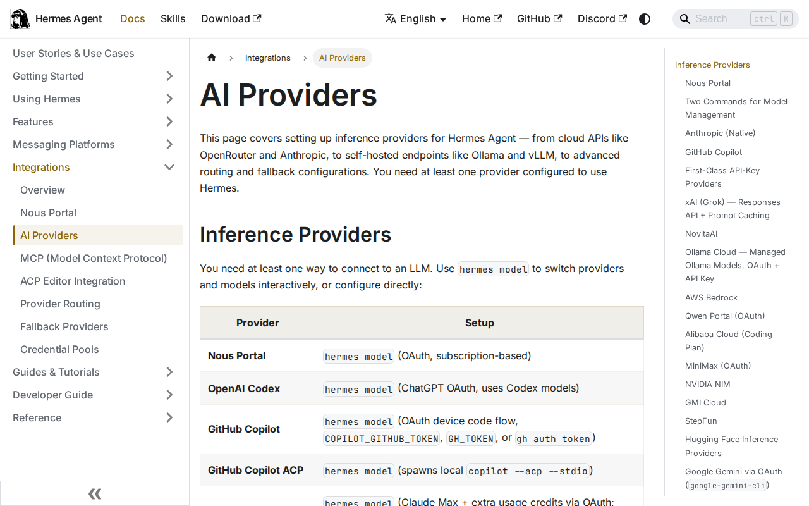

# Custom Provider Setup



## OpenAI Compatible Endpoint

Edit `~/.hermes/config.yaml`:

```yaml
model:
  default: "custom/my-model"
  provider: "custom"
  base_url: "https://myendpoint.andrisetiawan.com/v1"
  api_key: "your_api_key_here"
```

Or via CLI:
```bash
hermes config set model.provider custom
hermes config set model.base_url https://myendpoint.andrisetiawan.com/v1
hermes config set model.api_key your_api_key_here
```

## Verify
```bash
hermes chat -q "Hello, what model are you?" -Q
```
