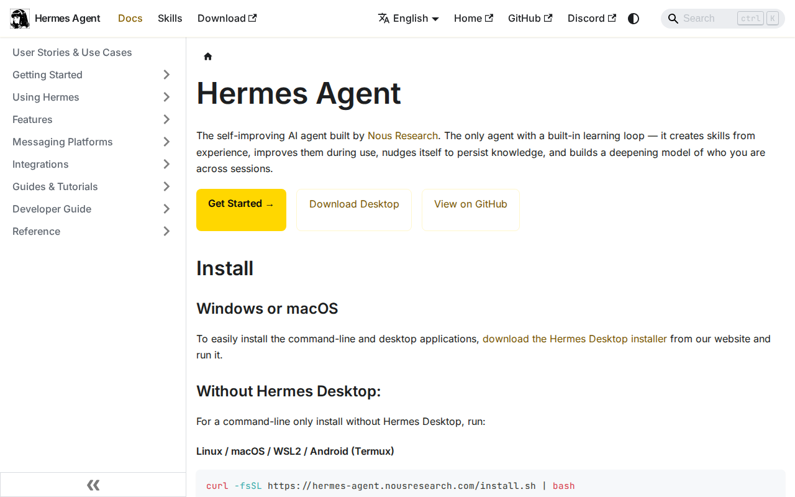
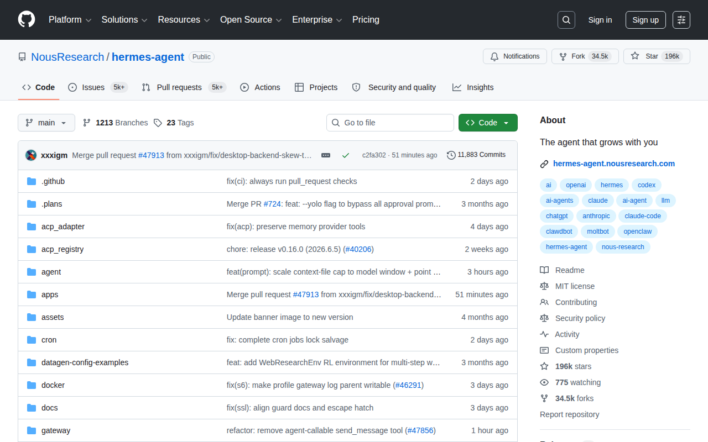
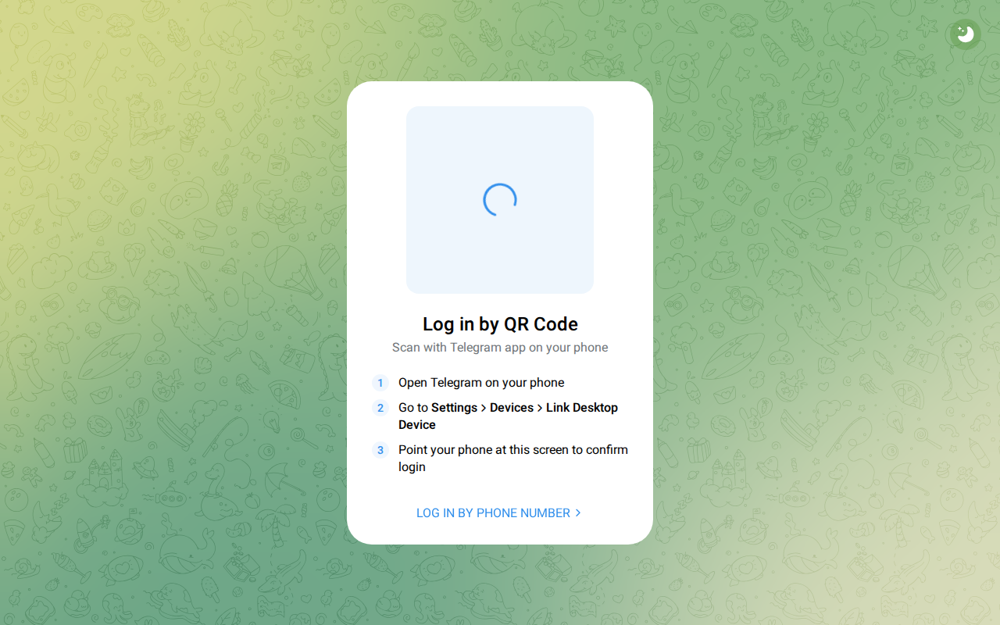
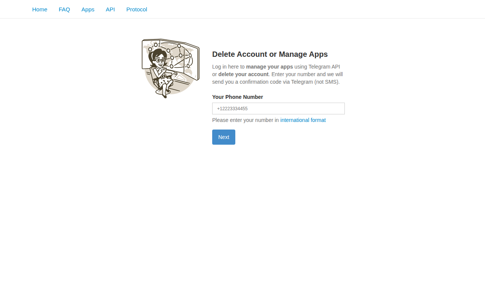
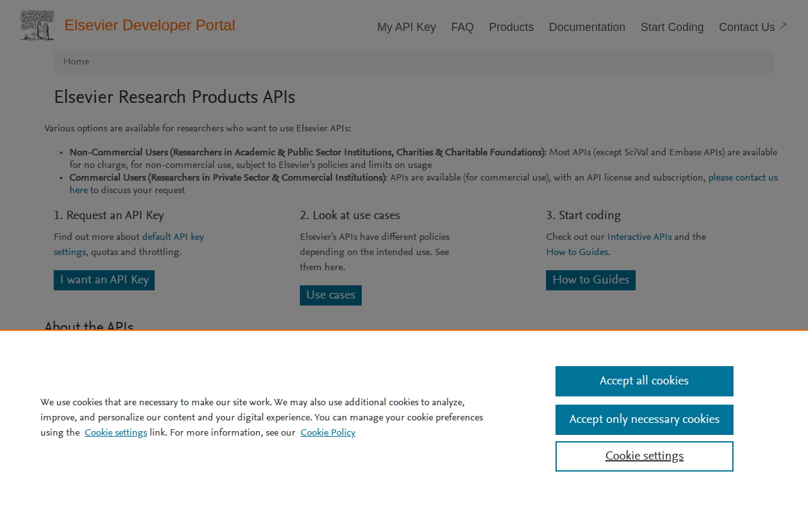
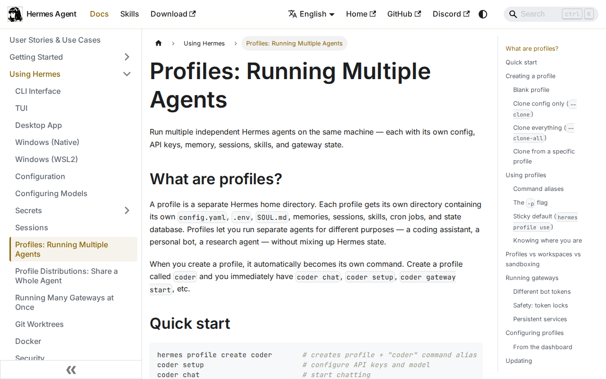

# Hermes Agent Workshop

A hands-on guide for setting up and using **Hermes Agent** for academic research, productivity, and AI workflows.

## Screenshot Gallery

| Chapter | Screenshot | Description |
|---------|-----------|-------------|
| 1 |  | Hermes Agent documentation |
| 2 |  | Hermes GitHub repo |
| 3 |  | Custom provider docs |
| 4 |  | Telegram Web |
| 5 |  | Telegram my.telegram.org |
| 6 |  | Elsevier Developer Portal |
| 7 |  | Google Cloud Console |
| 8 |  | Stitch with Google |
| 9 |  | Google NotebookLM |
| 10 |  | Hermes Profiles docs |

## Chapters

| # | Topic | File |
|---|-------|------|
| 1 | Install Hermes (Mac/Linux/WSL) | [INSTALL.md](INSTALL.md) |
| 2 | Custom Provider (OpenAI-compatible endpoint) | [PROVIDER_SETUP.md](PROVIDER_SETUP.md) |
| 3 | Telegram Bot + Account ID | [TELEGRAM_SETUP.md](TELEGRAM_SETUP.md) |
| 4 | Scopus API for SLR Research | [SCOPUS_SETUP.md](SCOPUS_SETUP.md) |
| 5 | Google Workspace (Gmail, Drive, Docs, Sheets) | [GOOGLE_WORKSPACE.md](GOOGLE_WORKSPACE.md) |
| 6 | Stitch UI Prototype | [STITCH_UI.md](STITCH_UI.md) |
| 7 | NotebookLM PDF Manager | [NOTEBOOKLM.md](NOTEBOOKLM.md) |
| 8 | Hermes Profiles for Specific Purposes | [PROFILES.md](PROFILES.md) |

## Quick Start

```bash
# Install Hermes
curl -fsSL https://raw.githubusercontent.com/NousResearch/hermes-agent/main/scripts/install.sh | bash

# Launch
hermes
```

## Author
Andri Setiawan — Universitas Islam Indonesia
